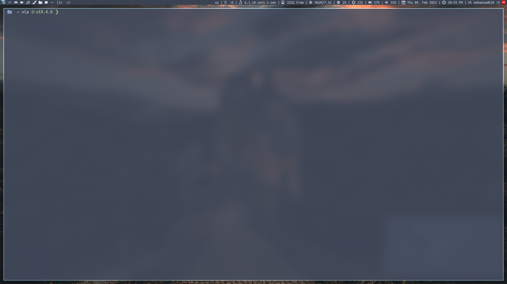

# st-pixelfiles

My Build of [St](https://st.suckless.org/) for [Pixelfiles](https://github.com/mohannadk28/pixelfiles/) :D

---

## Patches
1. [alpha](https://st.suckless.org/patches/alpha/)
2. [scrollback](https://st.suckless.org/patches/scrollback/)
3. [xresources](https://st.suckless.org/patches/xresources/)
4. [font2](https://st.suckless.org/patches/font2/)
